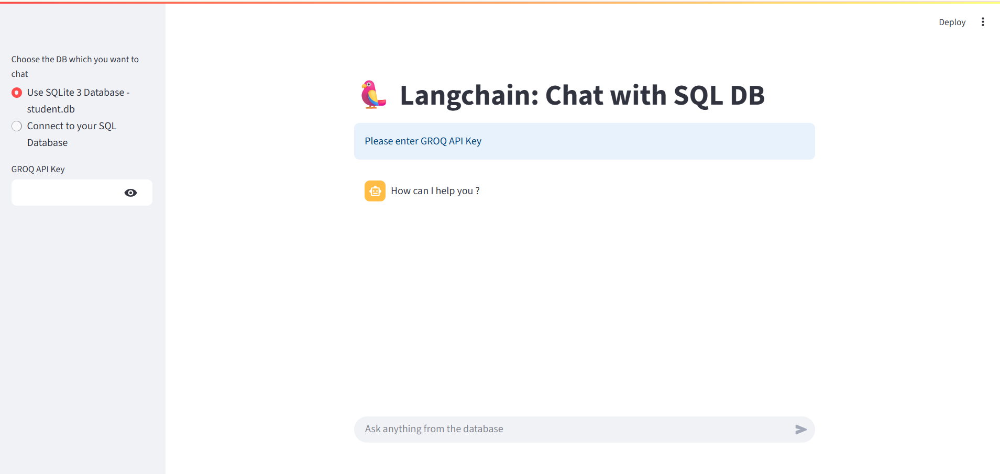

# 🧠 LangChain SQL Chatbot — Chat with Your SQL Database Using Natural Language

 <!-- Replace with actual image -->

This application allows users to **query a SQL database using plain English** powered by **LangChain Agents**, **GROQ's LLM (LLaMA 3.1)**, and **Streamlit**.

It supports:
- A built-in SQLite (`student.db`) database
- Your custom MySQL database connection

---

## ✨ Features

- 🔍 Ask natural language questions and convert them into SQL
- 💡 Uses `ZERO_SHOT_REACT_DESCRIPTION` LangChain Agent
- ⚙️ Supports SQLite and MySQL databases
- 🔐 Secure sidebar inputs for GROQ API Key and DB credentials
- 🧠 Backed by `llama-3.1-8b-instant` via GROQ
- 🛡️ Cached SQL engine using `st.cache_resource` for better performance

---

## 📦 Tech Stack

- [LangChain](https://www.langchain.com/)
- [Streamlit](https://streamlit.io/)
- [GROQ API](https://groq.com/)
- [SQLAlchemy](https://www.sqlalchemy.org/)
- SQLite / MySQL
- Python 3.10+

---

## ⚠️ Security Warning

```
This app uses LLM agents to generate SQL queries.
Always connect using a read-only database role in production to prevent SQL injection.
```

---

## 🛠️ Setup Instructions

### 1. Clone the Repository

```bash
git clone https://github.com/your-username/langchain-sql-chatbot.git
cd langchain-sql-chatbot
```

### 2. Create a Virtual Environment

```bash
python -m venv env
```

Or using Conda:

```bash
conda create -p venv python=3.10 -y
```

### 3. Activate the Environment

- **Windows**:
  ```bash
  .\env\Scripts\activate
  ```
- **macOS/Linux**:
  ```bash
  source env/bin/activate
  ```

### 4. Install Requirements

```bash
pip install -r requirements.txt
```

### 5. Create `.env` file

Although optional, you can create a `.env` file to store your GROQ API key:

```env
GROQ_API_KEY=your_groq_api_key
```

---

## ▶️ Run the Application

```bash
streamlit run app.py
```

---

## 🖼️ UI Preview

> Add a screenshot of your app inside `assets/sql-chatbot-demo.png`.


---

## 📁 File Structure

```
langchain-sql-chatbot/
├── app.py
├── student.db
├── requirements.txt
├── .env.example
├── README.md
└── assets/
    └── sql-chatbot-demo.png
```

---

## 🙋‍♂️ Contributing

Contributions, bug reports, and feature requests are welcome!

---

## 📬 Contact

- **Author**: Anas Malik  
- **LinkedIn**: [linkedin.com/in/anas-malik-01](https://linkedin.com/in/anas-malik-01)

---

> Built with ❤️ using LangChain, GROQ, SQL, and Streamlit.
